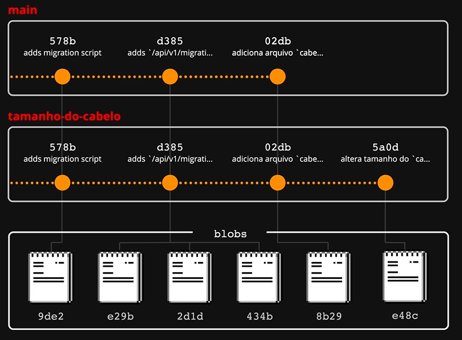
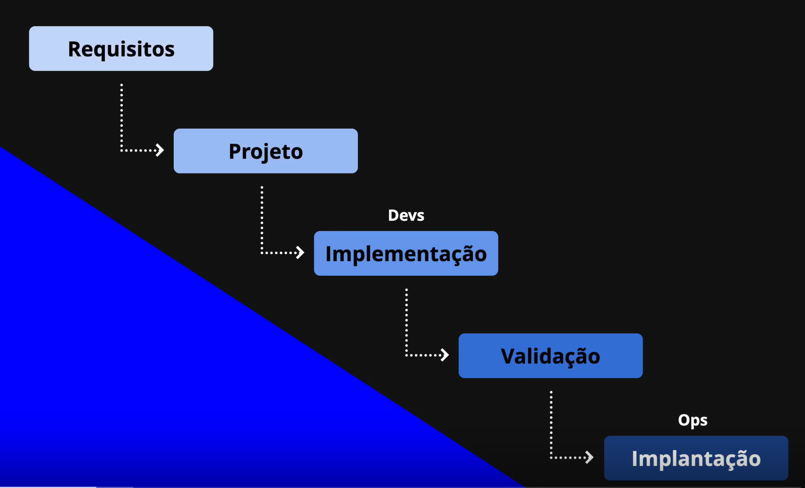
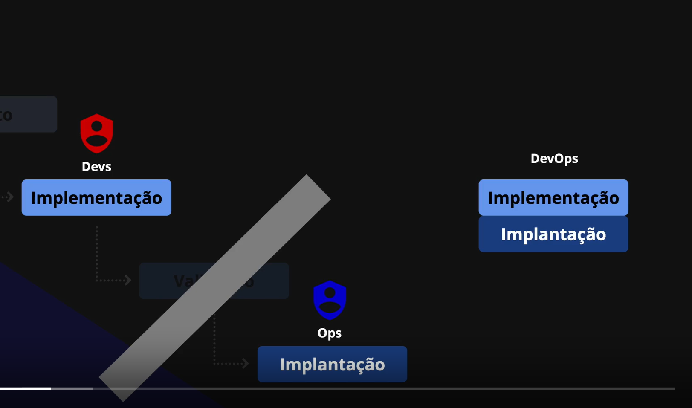
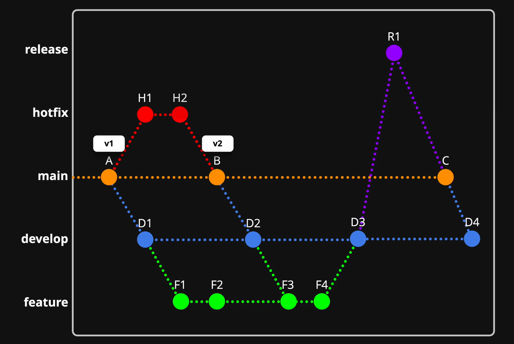

# Minhas anotações

## Pista Lenta - Protocolos e rodando o site de forma local

Existem diversos protocolos e com diferentes objetivos, alguns exemplos:

- HTTP - HyperText Transfer Protocol
- FTP - File Transfer Protocol
- SMTP - Simple Mail Transfer Protocol
- UDP - User Datagram Protocol

Os protocolos definem um acordo conhecido entre duas partes e como devem se comunicar. Na comunicação entre os protocolos pode ocorrer erros e perda de pacotes, mas existem meios de tentar recuperar esses pacotes perdidos.

Existem casos que você quer saber se a informação chegou no ponto final e outros momentos que não é preciso saber disso, por exemplo, na chamada de vídeo onde você pode perder um pedaço da informação mas não tem problema. UDP é um tipo de protocolo que não precisa de uma confirmação de recebimento, é um pacote autocontido, o que é diferente do TCP.

Vídeo da diferença entre o protocolo UDP e TCP [HTML5 Games - UDP vs TCP](https://youtu.be/ZEEBsq3eQmg).

## Pista Lenta - Página inicial

O NextJs faz um roteamento baseado em arquivos, conhecido como File-Based Routing, foi inspirado como o PHP faz as rotas.
Ao adicionar um arquivo chamado index.js/index.ts na pasta pages, ele automaticamente vira uma rota, por exemplo:

- pages/index.js ---> / (diretório real)
- pages/produtos/index.js ---> /produtos (pasta)
- recuperar-senha.js ---> /recuperar-senha (arquivo)

Responsabilidade do Next e do React. React vai entregar os objetos concretos, como os componentes visuais, o Next vai fazer o roteamento desses arquivos

## 🚗 Pista Rápida: Dia 05

O Git funciona com versionamento distribuído. Ponto importante, o Git não salva somente as diferenças entre os arquivos que nem o CVS, por isso ele é mais rápido, porque não há necessidade de processar arquivos antigos para chegar no atual, mas acaba ocupando mais espaço.

Resumindo, o Git faz uma cópia (foto) inteira do arquivo que foi modificado e salva ele como um BLOB (Binary Large Object), e adiciona um identificador. Caso você altere este arquivo ele cria uma nova cópia e adiciona um novo identificador e se um outro arquivo não foi modificado ele só faz um apontamento para o arquivo não modificado. O Git não armazena o diff, ele faz um cálculo para obter a diferença entre os arquivos.


### Comandos:

- git log - listar os commits do repositório.
- git add - sobe alterações para a staging area.
- git commit - realiza novos commits.
- git commit --amend - substitui o commit anterior por um novo, mas aproveita as alterações dele.
- git diff - calcula a diferença entre as versões/alterações dos arquivos.
- git commit --amend - modifica um commit já feito. Ele cria um novo identificador para o commit.

## 🚗 Pista Rápida: Dia 6

Ao utilizar um git amend para substituir um commit que já foi para o repositório remoto, ele vai dar um erro ao fazer o push, pois vai sobrescrever o hash do commit, sendo necessário fazer um pull para resolver o problema. Commits são imutáveis

### Comandos:

- git commit -m "mensagem" - atalho para fazer novos commits.
- git push - empurrar alterações locais para o origin.
- git push --force - empurrar de forma forçada alterações locais para o origin.
- git push -f - a forma comprimida do comando anterior.

## 🚗 Pista Rápida: Dia 7

## Client e Server

Algumas pessoas começam a se confundir sobre quem é o client e quem é o server, pois eles não são papeis fixos e dependem do que exatamente estes componentes estão fazendo. Ter a modelagem correta na mente sobre isso é algo valioso, pois ela destrava novas percepções sobre a arquitetura de todos os softwares envolvidos em um sistema.

É importante saber que esses papeis não são fixos e depende de como está funcionando essa relação. O cliente pode se tornar servidor a partir do momento que ele estiver SERVINDO um outro cliente e um servidor pode se tornar cliente quando está CONSUMINDO outro serviço de outro servidor. Por exemplo:


Principle of Least Privilege (Princípio do Menor Privilégio ), para uma maior segurança dos sistemas é importante liberar a menor quantidade de privilégios. Porque tudo isso pode ser um vetor de falhas segurança.

## 🚗 Pista Rápida: Dia 8

## Programação "Orgânica" versus "Impressora 3D"

- O que é Over Engineering?

  - Over Engineering é um termo utilizado para descrever um projeto que é mais complexo do que o necessário para resolver o problema que ele se propõe a resolver.

- O que é Feature Creep?
  - O Feature Creep, também conhecido como inchaço de recursos, é uma situação em que seu site tem muitos recursos, dificultando o uso e a navegação dos visitantes.

## Por que meus projetos sempre dão certo?

O Lixo de um é o tesouro do outro. Prestar atenção que o seu tesouro pode não ser o do outro e tudo bem :).

## 🚗 Pista Rápida: Dia 9

## Qual o “segredo” para organização de tarefas?

- Fazer muito com pouco e não pouco com muito... esse é um dos segredos que eu percebi quando o assunto é organização de tarefas.

Um ponto importante que o Filipe comentou nessa aula é sobre anotar os objetivos e deixar elas expostas para que possamos ver quais são as metas que precisam ser alcançadas. Isso envolve ter organização e anotação do que precisa ser feito, como um to-do list. Existem atividades que são mais ou menos custosas de serem feitas e é importante usar uma abordagem que sempre possamos ter um saldo positivo ao realizar elas.


# Organização de tarefa

---

Fazer muito com pouco.

Planejamento grande e pouco resultado.

Planejar pouco e executar.

Nível 1:

`Ser lembrado individualmente`

Fazer um lembrete diário para fazer o projeto;

Menor custo de produção;(quanto custa de energia);

Menor tempo de aquecimento;(quanto tempo demora para ver conferir o que precisa ser feito.);

`DICA: Anotar num papel e deixar em cima da mesa`;

Nível 2:

`Ser lembrado em grupo`;

`Dica: por algum papel grande em algum lugar comum;`

Nível 3:

`Expandir conhecimento`

Poder de conversar e desenvolver de forma detalhada `“o que?”` e `“como?”` algo deve ser feito;

Trello ou github;

Desenvolver conhecimento lá dentro;
!CUIDADO: esse é mais trabalhoso, tem de ir ativamente atrás;

Nível 4:

`Gerar métricas`;

Mensurar produtividade de pessoas trabalhando nas tarefas;

Carga adicional que serve mais para o gestor que para ela;

---

## Como peitar projetos de qualquer tamanho?

Você gosta de comer pedra? Não responde ainda! 😂 Deixa eu falar algo antes 🤝

Deixa eu te preparar para que, se você se pegar numa situação em que o seu cérebro está tentando negociar com você um "tudo ou nada", por exemplo: "ou programa o sistema inteiro que você quer fazer nesse final de semana ou não faz nada" é porque ele quer que você faça nada... sabe por que? A resposta está na aula.

Não existe só o caminho, fazer tudo ou fazer nada. Podemos fazer pouco a pouco, ganhando pouca "recompensa".

Quebra as pedras (entendesse como ideia) em pedaços menores que sejam mais palpáveis. As primeiras marretadas para quebrar a pedra, quebram elas em pedaços não uniformes e esses pedaços são imprevisíveis, difíceis de serem consumidos.

## Criando a primeira Milestone e Issues do Projeto

Nesta Pista Lenta iremos criar tanto a Milestone 0: Em construção, quanto as 3 Issues abaixo:

- Colocar o site num domínio .com.br
- Definir estilização do código e configurar editor
- Programar página de "Em construção"

Fora conversar sobre a mecânica do neurotransmissor mais importante quando o assunto é se sentir motivado a iniciar, continuar e concluir tarefas:


Treinar a disciplina e tomar a rédea das ações é um passo importante.

observação: Uma milestone (marco) é uma atividade maior que vai ser dividida em issues (problemas) menores.

## 🚗 Pista Rápida: Dia 10

Não sei se você notou, mas a gente está passando um pente fino em tudo e no Dia 10 não vai ser diferente. Eu digo isso porque eu já conversei com muitos desenvolvedores seniores que eram “seniores ocos”... e eu não estou querendo machucar ninguém falando isso. Primeiro porque é algo muito comum, muito mais comum do que muita gente que ainda não é sênior possa imaginar que seja assim, e segundo e mais importante, nas conversas que eu tive, a própria pessoa revelava isso (de ter essa insegurança) e isso foi um dos grandes motivos de eu colocar na mensagem principal do curso.dev…que "se sentir competente em programação começa aqui".

Então pra isso acontecer, pra de verdade se sentir completamente competente, não tem pra onde escapar... é preciso trabalhar o lado pessoal/profissional e o lado técnico e o Dia 10 junta essas duas coisas 💪.

## Uma história macabra sobre "Estilização de Código"

É importante manter sempre um estilo de código para termos padronização no código. Para isso podemos utilizar algumas ferramentas para isso como [EditorConfig](https://editorconfig.org/), dependendo do projeto podemos ter vários programadores e cada um com seu estilo de codar, assim o projeto pode ficar bagunçado e sem padrão.

## Configurar o EditorConfig

O EditorConfig é um Configurador de Editor e por ele a gente vai definir regras fundamentais de como o seu Editor deve se comportar como, por exemplo, qual a largura da indentação do código, se será uma indentação mais curta ou mais comprida e se nela deve usar o caractere de espaço ou tab. Mas importante destacar que essas regras irão acontecer antes de você salvar um arquivo.

## Configurar o Prettier

Prettier é um formatador de código opinativo. Ele impõe um estilo consistente analisando seu código e imprimindo-o com suas próprias regras que levam em consideração o comprimento máximo da linha, encapsulando o código quando necessário.

## 🚗 Pista Rápida: Dia 11

DNS (Domain Name System) converte o domínio em um endereço IP.


O fluxo de acesso ao servidor dns pode ser exibido da seguinte forma, porém a mecânica dele não funciona. Porque quem acessa realmente o servidor é o cliente (pc de acesso) não o servidor de DNS. O servidor DNS só traduz o domínio.

Fluxo de acesso ao servidor DNS:


Mecânica de funcionamento:


O servidor servidor de DNS fornece o IP do domínio e entrega para o cliente e ele acessa o site (sistema).

## Você conseguiu encontrar o link secreto!

Dica bônus do Filipe, não somos apenas usuários, devemos ter curiosidade, devemos testar, função sem medo. Não devemos ter medo que nossa aplicação quebre, temos que mexer, ser curioso.

## Resolução de DNS (Desafio Nível 2)

Arquitetura hierárquica de como é obtido o IP de um servidor através do DNS


Porém essa forma de acesso pode ser muito custosa e esse dados não vão mudar. Então no meio disso é usado o TTL (Time To Live), o TTL é uma estratégia de cache de quanto tempo um registro deve ser mantido em cache. Todos os passos podem ser e devem ser cacheados para reduzir o tempo da consulta, por isso ao alterar um dns ele leva um tempo para se propagar.

## 🚗 Pista Rápida: Dia 12

Foi configurado um domínio e foi apontando para o servidor de dns da Vercel [meu site](https://gabrielbmcode.com.br/). Houve também um capture the flag.

## 🚗 Pista Rápida: Dia 13

## Página "Em Construção" e Encerramento da Milestone 0

...
Em paralelo a isto, eu apresento a Ideia McDonalds e mostro como eu usei ela para destravar o desenvolvimento de times em situações da vida real e também para conseguir destravar as minhas próprias ideias 🤝
...
Ideia MC Donalds ou teoria MC Donalds ela ajuda a destravar e engajar alguma ideia. Ao estar em uma equipe tentando ter uma ideia e as pessoas não conseguem fluir, é sugerido algo bizarro, sem compromisso, isso acaba dando um ponta pé inicial. Ao dar uma ideia "ruim" seu próprio cérebro irá produzir outras ideias para se afastar da ideia ruim. Isso serve ao estar em uma equipe, quanto estiver só

## Não confie em nenhum serviço 🛑

...Agora, uma coisa que você não pode confiar e que não existe, é 100% de Uptime, ou seja, um serviço consiga dentro de um ano ficar online 100% do tempo nos mais de 31 milhões de segundos que um ano tem.

Esse acordo de uptime é definido através de um SLA (Service Level Agreement / Acordo de Nível de Serviço).

## 🚗 Pista Rápida: Dia 14

## 🎁 Bônus: PoC e MVP ajudam mesmo?

Que massa que você acessou a aula bônus e nela vamos conversar sobre uma confusão relacionada aos termos PoC e MVP.

- PoC (Proof of Concept / Prova de Conceito)
- MVP (Minimum Viable Product / Mínimo Produto Viável)

A POC pode ser feita a seguinte analogia, ao ter um grande navio para encontrar um porto o que é mais fácil, levar um barco menor com uma pessoa, ou levar o navio inteiro?.
Um MVP muito bem aplicado é criar de forma ULTRA SIMPLES E ULTRA FOCADO uma feature, sem criar sombras em outras funcionalidades. Isso é um MVP muito bem aplicado.

- POC: Trata-se de um exercício, uma maneira de verificar se uma ideia é, antes de tudo, viável num determinado contexto de negócio. Esse método é excelente, sobretudo ao lidarmos com inovação envolvendo alto risco de entraves e problemas (o que eu diria é o mais comum de se vivenciar no processo de desenvolvimento de software).

- MVP: Principalmente presente no contexto de startups, mas não restrito a ele, um MVP é uma possibilidade de versão inicial de um produto, lançado com foco total na resolução da principal dor do usuário, bem como na experiência dele. Embora possa parecer, não se confunde com uma versão simplificada ou um protótipo de produto, muito menos uma POC. Pelo contrário, é um produto completo com seu mínimo necessário, ou seja, feito com mais rapidez e menos demanda de desenvolvimento, porém que é para ser lançado e tem-se o intento de ser utilizado pelo consumidor final.

### Resumindo

- PoC: Testes iniciais, com o menor custo possível, feitos para decidir qual caminho o projeto seguirá.
- MVP: Produto minimamente funcional para atender e resolver um problema, de acordo com a decisão tomada a partir dos testes (PoCs).
- Ou seja, os dois deveriam andar juntos, não ignorando nenhum deles no momento de planejar um grande projeto para evitar o máximo possível gastos desnecessários e retrabalhos no meio do projeto.


Mais informações: [POC, MVP, protótipo e piloto: qual a diferença e quando utilizar cada um?](https://www.cursospm3.com.br/blog/poc-mvp-prototipo-piloto-diferenca/) e [Melhorando o entendimento do MVP](https://cleitonmafra.medium.com/melhorando-o-entendimento-do-mvp-a486d5161dd2)

## Inauguração Milestone 1: Fundação

Uma conexão persistente (conexão persistente HTTP) é um canal de comunicação de rede que permanece aberto para mais solicitações e respostas HTTP ao invés de fechar após uma única troca. É um websocket

## Uma história macabra sobre "Overengineering"

Esta é mais uma aula que vai trazer experiência da vida real e que eu tento passar um pouco da minha "imunidade tecnológica" para você no que trata de algo que pode matar o seu projeto, o temido e confuso Overengineering.

Programar de mais o software e aplicar muita engenharia nele pode ser problemático. É melhor criar softwares simples e ir melhorando ele, do que criar softwares complexos e simplificar ele. ALGO SIMPLES NÃO É ALGO MAL FEITO.

Exemplo da evolução do código (kkkk verdade)


Porém um código simples não é um código mal feito, coisa que fazemos quando começamos a carreira, o ideal é encontrar um ponto de equilíbrio:


Criar algo simples pode ser mais difícil do que algo mais complexo, pois o custo mental é maior.

O Software deve ser modificável, criar um software com a stack "perfeita", mas que não exista documentação ou que não existam profissionais para contribuir pode ser um problema. O software precisa ser modificável no curto, médio e longo prazo. Então a principal característica de um software śer modificável:

.

## Proposta de Arquitetura e Pastas

Arquitetura de software não tem a ver com organização das pastas, são duas coisas separadas. A arquitetura de software é definida pelo escopo dos componentes onde começam e terminam em conjunto com a interação entre eles.

Um exemplo de underengeerning é quando um software tem diversos códigos sem começo e fim, espalhados, sem seguir uma separação lógica.

A arquitetura MVC (Model View Controller) foi inventada em 1979 e é uma das mais simples. Dica: Uma arquitetura simples MVC com uma boa modelagem.

Arquitetura de Software não está ligada diretamente a organização de pastas, mas sim nas definições de escopos de funcionalidades/módulos e o relacionamento/interação entre eles.

## 🚗 Pista Rápida: Dia 15

Eu não to brincando quando eu falo que o Dia 15 pode mudar de verdade a sua vida na programação, isso porque ela ficou reservada para falar sobre Testes Automatizados e que é um tema que, se você engata, se você entende os benefícios e usa para programar de uma forma melhor e mais despreocupada, muda completamente o seu fluxo de trabalho e é um caminho sem volta... sem volta mesmo!

Texto complementar sobre teste [Testes automatizados: saiba o que são, como e porquê usar!](https://blog.betrybe.com/tecnologia/teste-automatizados/)

## Instalar um Test Runner

Um Test Runner nada mais que um código que testa outro código. Serve para testar de forma automatizada o trabalho que uma pessoa faria, por exemplo um cadastro com e-mail inválido, depois válido e em seguida tentar cadastrar com o mesmo email, etc. Se cadastrar com o mesmo e-mail e retornar erro, é um erro esperado, etc. Verifica se uma parte do sistema está funcionando de forma correta. Caso se uma das condições esperadas não sejam atendidas, como por exemplo o sucesso ao cadastrar com um email duplicado, isso é uma falha.

É válido que iremos por um sistema no ar sem REGRESSÃO.

## Criar um "Teste de Teste"

Nos testes automatizados é possível criar a feature e depois testar, mas o ideal é criar o teste para depois criar a feature.

Um teste pode se dizer que temos dois lados, na esquerda é um valor dinâmico, na direita o valor esperado pode ser hardcoded, inclusive é aconselhável que seja hardcoded.


## Criar um "Teste de Verdade"

Um teste não tem a capacidade de afirmar que um código está funcionando, ele tem a capacidade de afirmar se algo aconteceu ou não. Ele serve para montar cenários para testar a implementação por vários ângulos. Não seja "fofo" ao criar cenários de testes, o intuito não é só escrever códigos que passam pelo caminho feliz, tenha o contrário.

Um teste pode servir como uma documentação do sistema, pois ele roda um cenário real. Já um documento externo pode ficar desatualizado. O teste deve cobrir todas as variações de entrada.

O TDD (Test Driven Development / Desenvolvimento Orientado a Teste), podemos traduzir isso de outra forma, Desenvolvimento Orientado Por / Pelo Testes. Os testes devem orientar o desenvolvimento. Primeiro a gente específica no teste o que é esperado que nosso programa faça e depois escreve esse programa.

Para saber mais: [TDD: o que é e por que vale pena](https://blog.betrybe.com/tecnologia/tdd-test-driven-development/)

Isso pode a ajudar a ficar criativo, pois podemos pensar em cenários diversos que o usuário está.

Não necessariamente as pessoas sempre escrevem o código com TDD. Pode ter ocasiões, por exemplo, de quando a pessoa está cansada e só faz a feature e depois ele vai aplicar o teste. O teste é uma malha de proteção para o sistema.

## 🚗 Pista Rápida: Dia 16

Comentário lgalvani:

- Testes unitários: Esses testes focam em componentes individuais, como funções ou métodos, garantindo que cada pequena parte do sistema funcione corretamente de forma isolada.

- Testes de integração: Depois que os componentes individuais funcionam, é hora de verificar se eles funcionam corretamente juntos. Componentes individuais que passaram nos testes unitários podem falhar totalmente quando são integrados, geralmente devido a falhas de comunicação de dados. Os testes de integração garantem que os dados fluam corretamente entre os módulos e que as interfaces sejam sólidas.

- Testes E2E: Os testes ponta a ponta validam toda a aplicação, desde a interface do usuário até o back-end, garantindo que o sistema funcione como um todo. Esses testes proporcionam alta confiança no atendimento aos requisitos de negócios, mas são mais lentos e complexos. Por causa disso, eles devem ser limitados a fluxos de trabalho críticos para evitar instabilidade.

## A maior briga no universo dos Testes Automatizados

Testes Automatizados é um assunto tão importante quanto ele é passível de gerar briga na internet e nessa aula eu vou mostrar o motivo. É muito importante você estar preparado para esse tipo de discussão, principalmente sobre a diferença entre testes `unitários`, `integração` e `e2e` 💪.

A ordem dos testes importa! Esse é um norte padrão de quantidade de testes que seu sistema deve ter junto com a representação de quantidade de teste

Pirâmide que norteia 

Mas existe a discussão sobre outros modelos de teste conforme o exemplo abaixo:
X do usuário @swyx


Novo termo API First: Significa que tudo que um cliente consiga fazer no sistema, disponibilizar isso primeiro através da API Rest.

## Encostando a mão no Protocolo HTTP 🔥

Endpoint (ponto final), é o local final onde uma requisição vai chegar. Tudo basicamente pode ser definido com um endpoint, por exemplo `google.com`, porém esse termo é utilizado no contexto de API (Application Programming Interface / Interface de Programação de Aplicações).

Tudo pode ser interpretado como interface, e as interfaces podem ser um CLI, uma página na web, uma função, o microondas possui uma interface, tudo que interagimos temos um interface.

Tipos de interfaces:

- TUI: Text-based User Interface / Interface de Usuário baseado em texto (utilizado em terminal).
- GUI: Graphical User Interface / Interface de Usuário Gráfica (comumente a mais utilizada por usuário em geral).

No Next é também é possível criar os end-points através do File-based routing.

CURL é um Client URL de terminal. Exemplo de chamada do curl no terminal!

[curl](./_img/curl.png)

as setas com o sinal de maior `>` representa a request, já as setas com o sinal de menor representa `<` a response, o `*` são ações internas do próprio curl

## Não é magia! (é Protocolo)

Eu sugiro você ter um único objetivo com estas aulas mais recentes, que é acreditar que, na área de tecnologia ou na programação num geral, não existe magia... não existe mesmo! Toda informação está em algum lugar e você pode não conhecer esse lugar e naturalmente assumir que é um local mágico, mas não é.

Então nesta aula nós iremos cavar um pouco mais o Protocolo HTTP na procura de informações que muitas pessoas encaram como "mágicas" 💪

## Versionamento de API e Endpoint "/status"

A API pode mudar, porém ela muda menos que uma interface. Quando ela precisa mudar, ela muda as informações que estão sendo desenvolvidas. Essas mudanças podem ser organizadas em duas categorias: Breaking Change e Non-breaking Change.

Uma mudança Breaking Change é do tipo que pode quebrar a integração, por exemplo a interface, quebrou o contrato entre o client e o server. Exemplo: alterei um campo chamado anteriormente de nome_de_usuario para username. Isso vai quebrar, porque o código que fazia a leitura desses scripts não irá identificar o campo.

Uma mudança Non-breaking Change é uma mudança que não quebra a integração, por exemplo a adição de um campo novo em um object, nenhum script deveria depender de uma informação que ainda não existe, exemplo de um objeto de pessoa { nome: "Gabriel" } eu adicionar o campo de altura { nome: "Gabriel", altura: "183" }. Mas essa situação pode ocorrer, mas não deveria, é uma convenção que a adição de novos campos não quebre a API.

É possível fazer o versionamento de APIs, a estratégia mais comum existente é URI Path Versioning, onde é adicionado no endpoint a versão que vai ser utilizada e o outro método é o Header Versioning onde é adicionado no cabeçalho da requisição versão.


## 🚗 Pista Rápida: Dia 17

## Qual Banco de Dados escolher?

feature-proof significa a prova do futuro
A escolha de um banco de dados deve se levar em consideração alguns pontos:

- _DBMS - Data Base Management System ou SGBD - Sistema de gerenciamento de banco de dados. Exemplos de SBGD / DBMS_

  - Mysql
  - PostgreSQL
  - Oracle Database
  - MongoDB

- Tipos de bancos:
  - Relacional
  - Não Relacional
    - Armazenamento de Documentos
    - Armazenamento Chave-Valor
  - Série Temporal
  - Espacial

Geralmente é escolhido bancos relacional e não relacional. Vamos utilizar o PostgreSQL no banco

- _Query - Consultas_

  Para fazer as consultas em uma aplicação geralmente é usado um ORM (Object-Relational Mapping / Mapeamento Objeto-Relacional). Ele tenta abstrair o SQL através de métodos. Ele também abstraí a conexão com o banco e a aplicação, também ele ajuda na hora que você mudar o banco, as consultas já feitas não quebrarem. Como ORM iremos usar o pg (postgres-node).

- _Migrations - Migração_

  É uma forma de documentar as mudanças realizadas no banco de dados. É a forma de também de ter o controle de forma programática do banco, um tipo de versionamento, pois a alteração não foi feita de forma manual e sem documentação. E para fazer as migrações iremos usar o node-pg-migrate.

## Por que o Docker dominou o mundo?


## Subir Banco de Dados (Local)

YAML acrônimo recursivo para “YAML Ain’t Markup Language”.
O YAML é um super set para o JSON, mas ele parece mais com Python. Ele define a hierarquia dos elementos através da indentação, utilizando espaços em branco, ele não aceita usar o tab para fazer isso.

O arquivo Dockerfile é um código fonte que define os comandos que vão formar o ambiente virtual. O Dockerfile precisa ser compilado, e ele vira uma Image, e ao executar ele se transforma em um Container é na prática uma Image que está rodando, porém é no Container que vamos nos conectar.


É possível subir essa Image para o Docker Hub.

Segue os comandos para quem deseja instalar o Docker na máquina local:

```shell
# INSTALAR DEPENDÊNCIAS:
sudo apt-get install  curl apt-transport-https ca-certificates software-properties-common

# INSERIR CHAVE GPG:
curl -fsSL https://download.docker.com/linux/ubuntu/gpg | sudo apt-key add -

# ADICIONAR REPOSITÓRIO:
sudo add-apt-repository "deb [arch=amd64] https://download.docker.com/linux/ubuntu $(lsb_release -cs) stable"

# ATUALIZAR REPOSITÓRIO:
sudo apt update
sudo apt upgrade
apt-cache policy docker-ce

# INSTALAR DOCKER:
sudo apt install docker-ce

# VERIFICAR STATUS:
sudo systemctl status docker

```

## Se conectando no Banco de Dados (Local)

Conhecer problemas também é conhecimento. Evitar problemas é evitar conhecimentos.

Em protocolos http possui `Status Code` para retornar um tipo de informação, como sucesso e sem autorização, por exemplo.
Em processos existe o `Exit Codes`, no momento que um processo é encerrado ele retorna um código que representa se a saída desse processo teve sucesso ou não na visão do processo. Por convenção a saída 0 representa sucesso, já valores acima disso podem ser problemas, por exemplo 255.

Foi instalado esse client de terminal para se conectar ao Postgres durante a aula:

- `sudo apt install postgresql-client`

## 🚗 Pista Rápida: Dia 18

Nesta aula iremos criar o módulo database.js que é uma abstração da nossa infraestrutura e que vai ser responsável por abrir conexão com o Banco de Dados e enviar queries pra ele. Para isto, vamos instalar o módulo pg na versão 8.11.3 🤝

## Criar módulo "database.js"

```markdown
E para revisar o que aconteceu, em aulas passadas decidimos utilizar o banco de dados Postgres, correto? Só que para conseguir se comunicar com ele, é preciso saber conversar no protocolo que ele conversa (e que é bem difícil de se implementar). Dado isso, instalamos o módulo pg, pois ele sabe se comunicar nesse protocolo. Então nós utilizamos o pg para abrir uma conexão ao banco de dados e enviar uma query (um comando) contra ele e que por hora não possui nenhum dado dentro dele.

E para não precisar repetir o código responsável por abrir uma conexão, enviar uma query e fechar uma conexão em todos os locais na qual precisaremos trabalhar com o banco de dados, nós criamos uma abstração chamada database.js. Com ela, basta executar o método database.query() que toda gestão da conexão será feita por baixo dos panos e retornar o resultado pronto para ser usado.
```

## A importância das Variáveis de Ambiente

Quando eu realmente entendi o poder e a simplicidade das Variáveis de Ambiente, o meu cérebro deu alguns cliques muito importantes. Um deles foi de sempre que possível deixar a camada da aplicação stateless (sem estado) e isso se conecta perfeitamente com várias formas profissionais de se construir e escalar uma aplicação 💪

## Variáveis de Ambiente no Código

Qual a relação entre Variáveis de Ambiente, process, env e o que entra dentro do seu código? Vamos ver tudo isso dentro dessa aula e deixar sua aplicação 100% stateless 💪.

Bizu: para não salvar códigos digitados no `bash`, basta por um espaço antes do comando que ele não fique salvo.

## 🚗 Pista Rápida: Dia 19

## Foi certo fazer o commit do .env?

O software deve ser semântico, desde a criação dos nomes das variáveis ao nome de variáveis de ambiente.

`A semântica é o ramo da linguística que estuda o significado das palavras.`

## Uma história macabra sobre "Choque Elétrico" e "TDD"

Nota importante que aprendi nessa aula que nunca me toquei, nunca reparei que os imports do Node eram relativos, ou seja é necessário fazer toda a navegação para encontrar o arquivo desejado. O Node toma como base o caminho do arquivo, por exemplo:

```javascript
import database from "../../../../infra/database.js";
```

Se queremos garantir que uma mudança de um comportamento para outro, precisamos mensurar e/ou testar os dois comportamentos e não somente o estado final.

O insight que eu tive é, o teste realmente está validando a mudança que eu fiz? Se não posso, está deixando um erro ou bug passar sem perceber.

`determinar as dimensões de ou ter por medida; medir.`

## Configurar scripts dos serviços

o comando com down no final apagar o container e todo o registro que tem nele. O comando com stop ele pausa o container. O comando up com a flag -d sobe o container destachado, o contêiner não será interrompido quando o terminal for fechado. Para concatenar os scripts podemos usar o &&.

```json
{
  "dev": "npm run services:up && next dev",
  "services:up": "docker compose -f infra/compose.yaml up -d",
  "services:stop": "docker compose -f infra/compose.yaml stop",
  "services:down": "docker compose -f infra/compose.yaml down"
}
```

## 🚗 Pista Rápida: Dia 20

## Endpoint "/status": ISO 8601 + Fuso + MVC + lowerCamelCase

A arquitetura MVC é separada em `Model View e Controller`. A `Controller` não serve para computar os dados, essa camada pede pra model essa informação, a `Model` computa o dado ou a regra de negócio e devolve para a `Controller` que por fim ela devolve para `View` para o client poder consumir o dado.

A Controller coordena as operações dos Models.

`Controller -> Model -> Controller -> View`

Um dos motivos de não programar tudo na Controller é devido a falta de reaproveitamento de código.

Dica do Filipe, para variáveis no código javascript o `lowerCamelCase` é útil, mas para o json de resposta de aplicações REST o ideal é usar o `snake_case`.

Sobre TDD, no exemplo de teste para a verificação de datas tentamos cobrir o máximo de cenários possíveis, porém ainda existe a possibilidade de haver furos e tudo bem, é preciso caminhar com o software. É preciso calcular para saber se vale a pena criar os testes, porque às vezes pode ficar muito "caro" a criação de testes.

```javascript
async function status(request, response) {
  const updatedAt = new Date().toISOString();

  response.status(200).json({
    updated_at: updatedAt,
  });
}

export default status;
```

```javascript
test("GET to /api/v1/status should return 200", async () => {
  const response = await fetch("http://localhost:3000/api/v1/status");
  expect(response.status).toBe(200);

  const responseBody = await response.json();
  expect(responseBody.updated_at).toBeDefined();

  const parsedUpdatedAt = new Date(responseBody.updated_at).toISOString();
  expect(parsedUpdatedAt).toEqual(responseBody.updated_at);
});
```

## Database "Version" (+ Red, Green e Refactor do TDD)

[O ciclo de desenvolvimento do TDD](https://blog.xpeducacao.com.br/tdd-test-driven-development/)

O TDD possui três ciclos bem definidos chamados de Red-Green-Refactoring ou Red-Green-Blue. Esses ciclos podem ser melhor entendidos a partir da figura abaixo:

- Red
  A primeira etapa consiste em escrever um pequeno teste que falhará. Isso acontece porque o teste está esperando por uma resposta que ainda não existe, já que o código ainda não foi criado.

- Green
  Na segunda etapa, o código já foi criado e passa por novos testes até serem aprovados. Com os testes concluídos e o código funcionando sem erros, o desenvolvedor pode passar para o próximo ciclo.

  Nesse momento é importante o profissional entender bem quais são as necessidades do cliente. Assim, ele consegue desenvolver códigos que, quando agregados ao sistema, atendam às expectativas deles.

- Refactor
  Por fim, a última etapa do ciclo é a de refatoração do código. Aqui, é o momento de analisar o código que foi criado apenas para ser aprovado no ciclo Green e deixá-lo o mais simples possível.

  Dessa forma, é na fase de refatoração do código que ele passa por uma limpeza onde são excluídas as duplicidades, extraídas as classes, interfaces e métodos do sistema.

## Database "Opened Connections"

Ao utilizar parâmetros dinâmicos dentro de uma query, estamos abrindo margem para entrar um SQL Injection. Existem 3 formas de escrever uma querys:

1. Query sem parâmetro.
   Essa forma não é passível de injeção de SQL

2. Query com parâmetros fixos.
   Essa forma também não é passível de injeção de SQL pois fica harded code as opções de seleção.

3. Query com parâmetros dinâmicos.
   Essa forma é passível de injeção de SQL, porém é a mais flexível. Esse é o tipo mais comum de querys no projeto.

Ao usar a notação de `::tipoDoDado` o resultado faz um casting de tipo no resultado do banco.

```sql
-- original
SELECT count(*) FROM pg_stat_activity WHERE datname = 'local_db';

-- casting
SELECT count(*)::int FROM pg_stat_activity WHERE datname = 'local_db';
```

## SQL Injection e Queries Parametrizadas

Para evitarmos de sofrer ataques de SQL Injection devemos fazer uma query sanitization ou limpeza de consulta. Podemos fazer isso de forma `Manual`, identificando se a inserção do usuário possui algum comando como, insert, delete ou alter ou de forma Automática. Nunca fazer de forma manual, porque se você deixar passar algo a consequência pode ser devastadora.

query sanitization: A limpeza de dados é o processo de limpeza, validação e garantia de que os dados de entrada do usuário sejam seguros para consumo pelo aplicativo. No contexto de ataques de injeção de consulta, a limpeza de dados impede que invasores injetem operadores mal-intencionados como {$gt: ''} nas entradas do usuário.

Para fazer a limpeza utilizando o `node-postgres` devemos utilizar a notação de `$1` junto com o número, Isso deve dar um match na posição do array com as inserções que você deseja colocar no sql.

```javascript
const text = "INSERT INTO users(name, email) VALUES($1, $2) RETURNING *";
const values = ["brianc", "brian.m.carlson@gmail.com"];
```

Uma informação importante, ao ter uma consulta corrompida o código irá lançar uma exception e a conexão com o banco não será fechada. Utilizando o node-postgres usando um bloco de try/catch com o finally para sempre executar o fechamento da conexão com o bd.

```javascript
try {
  await client.connect();
  const result = await client.query(queryObject);
  return result;
} catch (error) {
  console.error(error);
} finally {
  await client.end();
}
```

## 🚗 Pista Rápida: Dia 21

O Dia 21 é extremamente denso e pode ser um daqueles dias em que você sai diferente do outro lado, ainda mais numa parte extremamente importante para a maioria das aplicações que é o Banco de Dados.

## Investigando logs da Vercel em Produção

_ClickOps_ o termo utilizado para uma pessoa de infraestrutura usando o mouse para sair clicando nos serviços, por exemplo, de banco de dados para criar manualmente os serviços de banco de dados.

_IaC Infraestructure as Code_ Infraestrutura como Código usado para subir, por exemplo, uma instância de banco de dados através de Terraform para subir um banco de dados na AWS.

Se você faz um throw no bloco catch e retorna algo no bloco finally, o retorno no bloco finally vai sobrescrever o throw e possivelmente esconder todos os seus erros!!!

## 🚗 Pista Rápida: Dia 22

Não existe profissional na nossa área, que se considere um profissional completo pelo menos, e que não sabe mexer com migrations.

As migrações podem ser interpretadas como um tipo de versionamento para o banco de dados.

## Por que as Migrations existem?

A ideia por de trás das Database Schema Migrations é solucionar o problema de ter que fazer alterações no banco de dados de forma manual, por exemplo, fizemos uma alteração do banco de dados em um ambiente local, agora precisamos subir essa alteração ambiente de produção, para evitar de ter que escrever esse código de forma manual ou esquecer de subir ele usamos as Migrations.

Ele é usado de forma consistente e imutável em qualquer tipo de ambiente. Isso deve ser versionado no código.

Para fazermos isso, utilizamos os Arquivos de Migração, eles que definem a ordem que o código deve ser executado e as alterações em si. Podemos utilizar um framework de migração para ser executado 1 vez. Não se deve utilizar as migrações mais de uma vez.

No projeto vamos usar o `node-pg-migrate` para fazer as migrações de banco de dados, ele é um módulo focado em fazer migrações Postgre. Existem outros libraries/frameworks que fazem esse tipo de tarefa, como o `Sequelize`, mas ele é mais flexível, diferente do `node-pg-migrate` que é mais focado.

Resumidamente o que uma migration faz:

1. Proibido alterações manuais.
2. Crie um arquivo de migração.
3. "up" para fazer alterações.
4. "down" para desfazer alterações.

## 🚗 Pista Rápida: Dia 23

## Migrations pelo endpoint “/migrations” (Dry Run)

Na implementação da API de migração vai ser possível criar códigos no modo `Dry run` e `Live run`.

- `Dry run`: Permite eu executar as migrações "de mentira" apenas para ver o que aconteceria caso fosse executado de verdade.

- `Live run`: Quando de fato as migrações serão executadas.

Na implementação o método `GET` executará o código `Dry Run` e o método `POST` executará o código `Live Run`

## Por que evitar a direção "down"?

Quando utilizamos o módulo `node-pg-migrate` podemos executar as migrações para frente com o `up` ou desfazendo as alterações com o `down`.

Existem motivos para evitar a direção `down` (rollback), são eles:

- Casos raros.
- Levam tempo.
- Motivação cai.
- Testar.

Eles levam mais tempo para serem escritos e podem remover dados do banco de dados. Por serem casos raros você não vai querer fazê-los se as pessoas estiverem desmotivadas talvez não vão testar de forma concreta, incluindo a falta de testes automatizados. Um exemplo que pode ocorrer é um teste automatizado apontar para um dado e o rollback (down) deletar a coluna onde estava esse dado e quebrar o teste automatizado. É melhor sempre fazer rollforward do que rollbacks.

## Migrations pelo endpoint "/migrations" (Live Run - Início)

Um teste de integração pode acabar mudando o state do banco de dados e isso pode ocasionar a quebra do teste. Isso ocorre porque o teste pode acabar inserindo ou modificando um dado. Uma abordagem para resolver essa situação é rodar o teste com um banco limpo, ou seja, limpar o banco antes de rodar os testes.

O efeito colateral desse tipo de teste é que não podemos rodar os teste de forma paralela, porque um outro teste pode esperar algum dado de alguma tabela ou coluna e ele pode não existir no banco. Os testes nessa situação precisam ser executados de forma serial. O `Jest`, por padrão, implementa os testes de forma paralela.

## 🚗 Pista Rápida: Dia 24

O dia 24 pode ser fechado com a frase que o Filipe disse na aula `Expandindo testes e refatorando implementação`: Não peça permissão, peça desculpas. Isso me faz refletir sobre ter atitude de agir, de melhorar algo que eu não gosto. Isso pode ser uma via de mão dupla, pode ser assertivo, como não, mas segundo o próprio Filipe, isso acaba dando mais certo do que não dando.

## 🚗 Pista Rápida: Dia 25

## Grande lição + Puxão de orelha 💪

Uma dica de ouro que o Filipe deu nessa aula foi sobre o `Bottom Line` que pode significar: Lucro Líquido ou Resultado Líquido. "No final das contas, é a linha que marca o resultado financeiro do período" é a linha que os donos mais se importam. É o que define se um projeto vai ou não continuar funcionando. Influenciar essa linha significa ganhar o jogo, resumidamente. Ter interesse em saber sobre custos e como maximizar os lucros de um projeto, saber o que é de fato importante financeiramente para ele pode ser algo que nos destaque. Saber dessa informação pode fazer a gente ter epifanias de ideias que podem impactar concretamente o resultado da empresa ou o que não é importante colocar a energia.

É importante para nós que somos técnicos influenciar a parte de negócio, porque no final das contas é ela que importa. Quando entendemos o negócio conseguimos entender como criar coisas que as pessoas querem pagar por aquilo, daí conseguimos parar de ter só discussões técnicas como foco e usamos a discussão técnica para chegarmos ao resultado do negócio.

## 🚗 Pista Rápida: Dia 26

## Git Branch (3 níveis de compreensão)

### 1º nível de compreensão de como funciona a branch

Cada branch pode ser uma cópia paralela a branch principal, logo essa cópia não altera o código da branch de origem. Isso é uma meia verdade, a primeiro momento podemos entender dessa forma, porém se o projeto fosse gigantesco poderia levar minutos para alterar de uma branch para outra, o que não ocorre.

### 2º nível de compreensão de como funciona a branch

O git reaproveita os blobs dos arquivos para formar as linhas do tempo diferente. Porém ainda não é a definição correta, pois não saímos de uma linha do tempo para outra.



### 3º nível de compreensão de como funciona a branch

O modelo mental dos blobs está correto, mas o git não duplica os commits entre as branchs, formando assim linhas do tempo separadas, tecnicamente as branchs é só um apontamento para um commit específico. Pode-se dizer que a branch é apenas um apelido para um commit. O HEAD aponta para a branch, que aponta para o commit. Uma analogia que pode ser feita é que a branch é como se fosse uma agulha de toca disco, onde você colocar ela no disco, vai tocar algo diferente, sendo possível só por ela em um lugar por vez.


## Fazendo deploy em Homologação (Staging)

Homologação (Staging) na Vercel se chama Preview, que é uma pre-visualização. Um ambiente de homologação deve ser o mais próximo de um ambiente de produção, tendo as mesma caracteristicas, rodando a mesma stack, mas rodando em novo ambiente. Esse ambiente é menos utilizado então não é necessário subir máquinas com a mesma capacidade que a de Produção.

Na vercel todos os commits feitos na `main` vão para produção, os demais irão para homologação, o que vai diferenciar um ambiente do outro será as variáveis de ambiente. As variáveis de ambiente de produção são as Production, já as de homologação são as Preview.

Comandos:

- `git branch` - lista as branchs que existem no repositório e informa qual estamos usando.
- `git status` - informa a branch que estamos usando e os arquivos modificados
- `git branch <nome-branch>` - cria uma nova branch no repositório.
- `git checkout <nome-branch>` - muda para a branch que gostaríamos de usar, o `checkout` também é usada em outras operações.
- `git switch <nome-branch>` - usado especificamente para mudar de branch.
- `git rm <nome-arquivo>` - apaga o arquivo informado.
- `git checkout -b <nome-branch>` - cria uma branch e já altera para a nova branch.

## 🚗 Pista Rápida: Dia 27

### Como nunca mais perder código com Git? (Desafio Prova de Fogo 🔥)

O comando `git reflog` registra todas ou todas referências que aconteceram no repositório. Pode ser entendido como um tipo de auditoria ou histórico de acontecimentos.

### Git Merge (Fast Forward)

O comando `jq` no terminal bash faz uma formatação de saídas json, o comando watch fica assistindo o comando especificado e o `-n 1` define um espaço de tempo em segundos.

```bash
watch -n 1 'curl -s https://gabrielbmcode.com.br/api/v1/status | jq'
```

## 🚗 Pista Rápida: Dia 28

O Dia 28 é um dia baga, e por isso entenda que é um dia denso, que vai fazer você ficar pensando por muito tempo em certas dinâmicas perigosas da nossa área, porque o objetivo é entender sobre Continuous Integration, Continuous Delivery e Continuous Deployment, mas não só entender o que são essas coisas, isso é fácil, o objetivo principal é entender por que a gente criou essas coisas 🤝

Link da apresentação
[Agile is Dead • Pragmatic Dave Thomas • GOTO 2015](https://www.youtube.com/watch?v=a-BOSpxYJ9M)

### Nascimento e "Morte" do Movimento Ágil

Esta é uma aula importante para entender "de onde viemos e para onde estamos indo" na nossa área, começando pela metodologia Waterfall e como isso impulsionou o Movimento Ágil iniciado em 2001. E como nem tudo são flores, eu destaco também os desafios que tive ao longo da minha gestão no Pagar.me e como que o "abuso do Movimento Ágil" levou a uma queda na produtividade e satisfação das equipes.

De qualquer forma, a parte ágil do movimento está longe de morrer e daqui para frente iremos ver o impacto que isso teve na forma que trabalhamos e iremos trabalhar por muito tempo 💪

Waterfall ou Modelo de Cascada

Antes do modelo ágil os sistemas eram desenvolvidos em Waterfall (Modelo de Cascada). Esse tipo de abordagem dava muito problema e era muito custoso para ser desenvolvido.



Manifesto agile para desenvolvimento [agile manifesto](https://agilemanifesto.org/iso/ptpt/manifesto.html)

Em 2007 pensando em diminuir o tempo de entrega foi desenvolvido o termo de DevOps, onde unia a área de desenvolvimento, área de operações e também incluia a área de validação para diminuir o ciclo de feedback. A área de validação entrou para automatizar tudo que desse, daí surgiu o termo CI Continuous Integration (Integração Continua).



A automatização começou pelo build dos projetos, depois foi automatizada a validação através dos testes automatizados. Isso foi inovação na época.

Para integrar tudo isso era usado uma ferramenta para fazer o controle de versão. Com a integração de um controle de versão também era possível fazer o CD Continuos Delivery (Entrega Continua), tudo que foi feito e validado é só apertar um botão para deployar. O intuito de automatizar ações é evitar erros humanos, o que pode ser prejudicial para um negócio.

Outro termo é CD Continuous Deployment (Implantação Contínua) para implantar a automação para a produção sem intervenção humana.

- Continuous Integration:
- Continuous Delivery:
- Continuous Deployment:

### Trunk-Based Development, Feature Branch e Git Flow

Uma das decisões mais geniais feitas no Git, no design do core dele, foi de que não existem branches especiais e isso deu aos desenvolvedores uma flexibilidade enorme para criar qualquer tipo de fluxo de trabalho. Dado a isso, nesta Pista Lenta irei revisitar os 3 principais fluxos, sendo que, a parte mais importante, é entender o motivo real de tanta preocupação sobre o assunto e tudo pode ser resumido em uma única palavra: entropia 🤝

As três estratégias de branches mais importantes, são elas:

- Trunk-based Development (Desenvolvimento Baseado em Tronco)
- Feature Branch
- Git Flow
- Trunk-based Development

A estratégia `Trunk-based Development` ao mesmo tempo é a mais simples e a mais sofisticada. Essa estratégia consiste em sempre integrar o código nele sem criar branchs. Começamos usando ele. Tudo até o momento foi feito na branch main e depois enviado para a main, inclusive a ramificação que fizemos veio da main e voltou para ela rapidamente.

A `Feature Branch` pra cada modificação do sistema ou ajuste se cria uma branch separada se trabalha nela e depois de concluído faz um merge para a branch principal.

O `Git Flow` começa a partir do main, se cria ramificações de hotfix (para correção de bugs), develop (para a validação) e feature (para o desenvolvimento de novas funcionalidades)



O `Trunk-based Development` se uma equipe commitar as coisas diretamente na main isso pode dar problema se não haver nenhum controle.

No projeto vamos usar Feature Branch com o GitHub Flow.
