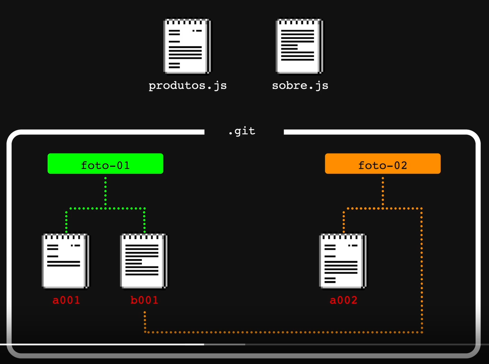

# Minhas anotações

## Pista Lenta - Protocolos e rodando o site de forma local

Existem diversos protocolos e com diferentes objetivos, alguns exemplos:
  * HTTP - HyperText Transfer Protocol
  * FTP - File Transfer Protocol
  * SMTP - Simple Mail Transfer Protocol
  * UDP - User Datagram Protocol

Os protocolos definem um acordo conhecido entre duas partes e como devem se comunicar. Na comunicação entre os protocolos pode ocorrer erros e perda de pacotes, mas existe meios de tentar recuperar esses pacotes perdidos. 

Existem casos que é você quer saber se a informação chegou no ponto final e outros momentos que não é preciso saber disso, por exemplo, na chamada de vídeo onde você pode perder um pedaço da informação mas não tem problema. UDP é um tipo de protocolo que não precisa de uma confirmação de recebimento, é um pacote autocontido, o que é diferente do TCP.

Vídeo da diferença entre o protocolo UDP e TCP [HTML5 Games - UDP vs TCP](https://youtu.be/ZEEBsq3eQmg).

## Pista Lenta - Página inicial

O NextJs faz um roteamento baseado em arquivos, conhecido como File-Based Routing, foi inspirado como o PHP faz as rotas.
Ao adicionar um arquivo chamado index.js/index.ts na pasta pages, ele automaticamente vira uma rota, por exemplo: 
  * pages/index.js ---> / (diretorio real)
  * pages/produtos/index.js ---> /produtos (pasta)
  * recuperar-senha.js ---> /recuperar-senha (arquivo)

Reponsabilidade do Next e do React. React vai entregar os objetos concretos, como os componentes visuais, o Next vai fazer o roteamento desses arquivos

## Pista Rápida: Dia 05 
  O Git funciona com versionamento distribuído. Ponto importante, o Git não salva somente as diferenças entre os arquivos que nem o CVS, por isso ele é mais rápido, porque não há necessidade de processar arquivos antigos para chegar no atual, mas acaba ocupando mais espaço. 
  Rumindo, o Git faz uma copia (foto) inteira do arquivo que foi modificado e salva ele como um BLOB (Binary Large OBject), e adiciona um identificador. Caso você altere esse arquivo ele cria um nova copia e adiciona um novo identificador e se um outro arquivo não foi modificado ele só faz um apontamento para o arquivo não modificado. O Git não armazena o diff, ele faz um calculo para obter a diferença entre os arquivos.

### Comandos:
  * git log - listar os commits do repositório.
  * git add - sobe alterações para a staging area.
  * git commit - realiza novos commits.
  * git commit --amend - substitui o commit anterior por um novo, mas aproveita as alterações dele.
  * git diff - calcula a diferença entre as versões/alterações dos arquivos.
  * git commit --amend - modifica um commit já feito. Ele cria um novo identificador para o commit.

## Pista Rápida: Dia 6
  Ao utilizar um git amend para substituir um commit que já foi para o repositóri remoto, ele vai da um erro ao fazer o push, pois vai sobreescrever o hash do commit, sendo necessário fazer um pull para resolver o problema. Commits são imutáveis 

### Comandos:
  * git commit -m "mensagem" - atalho para fazer novos commits.
  * git push - empurrar alterações locais para o origin.
  * git push --force - empurrar de forma forçada alterações locais para o origin.
  * git push -f - a forma comprimida do comando anterior.
